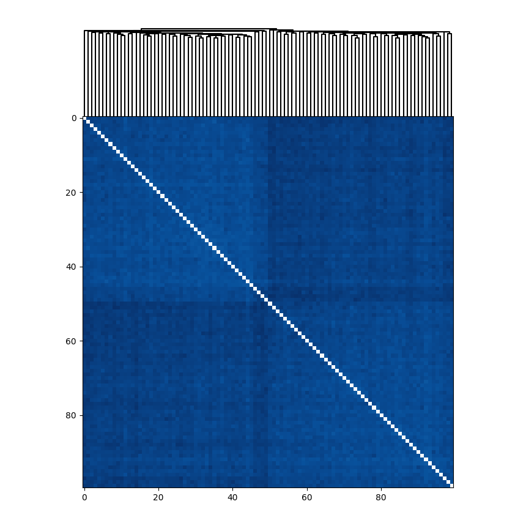
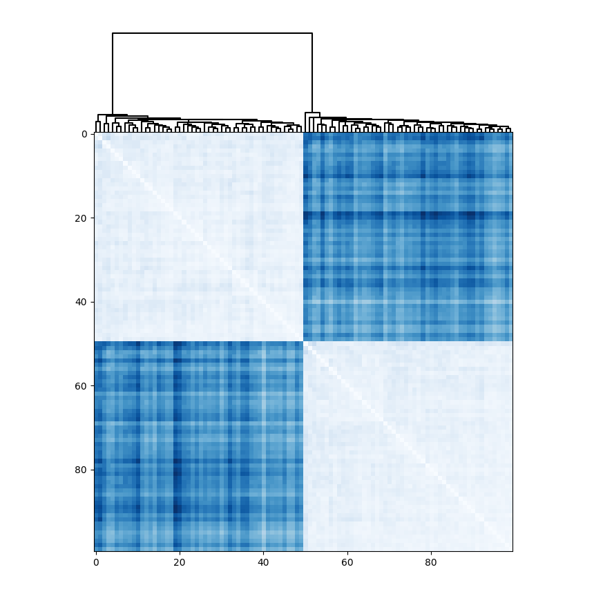

# pysparcl

Python implementation of the sparse clustering methods of Witten and Tibshirani (2010).

## Sample Results
|Hierarchical clustering|Sparse hierarchical clustering|
|:-:|:-:|
|||

## Functions

- Sparse KMeans clustering
- Sparse hierarchical clustering
- Selection of turning parameter for sparse KMeans clustering
- Selection of turning parameter for sparse hierarchical clustering

## Requirements

- Cython
- NumPy
- matplotlib (for running the sample script)
- scikit-learn
- SciPy

## Installation

### Install required packages
```
pip install cython
pip install numpy
pip install matplotlib
pip install scikit-learn
pip install scipy
```

### Getting pysparcl
```
git clone https://github.com/tsurumeso/pysparcl.git
```

### Run the setup script
```
cd pysparcl
python setup.py install
```

### Run the sample script
```
cd demo
python run.py
```

## Usage
```python
import matplotlib.pyplot as plt
import pysparcl

from scipy.cluster.hierarchy import dendrogram
from scipy.cluster.hierarchy import linkage
from scipy.spatial.distance import pdist


# data is nxp matrix (n samples p dimentional features)
bestw, _, _, _ = pysparcl.hierarchy.permute(data)
u, _, _, _ = pysparcl.hierarchy.pdist(data, wbound=bestw)
dist = squareform(u)
link = linkage(dist, method='average')
dendro = dendrogram(link)
plt.show()
```

## References
- [1] D. M. Witten and R. Tibshirani, "A framework for feature selection in clustering",  
Am. Stat., vol. 105, no. 490, pp. 713–726, 2010.
- [2] "sparcl: Perform sparse hierarchical clustering and sparse k-means clustering",  
https://cran.r-project.org/web/packages/sparcl/index.html
